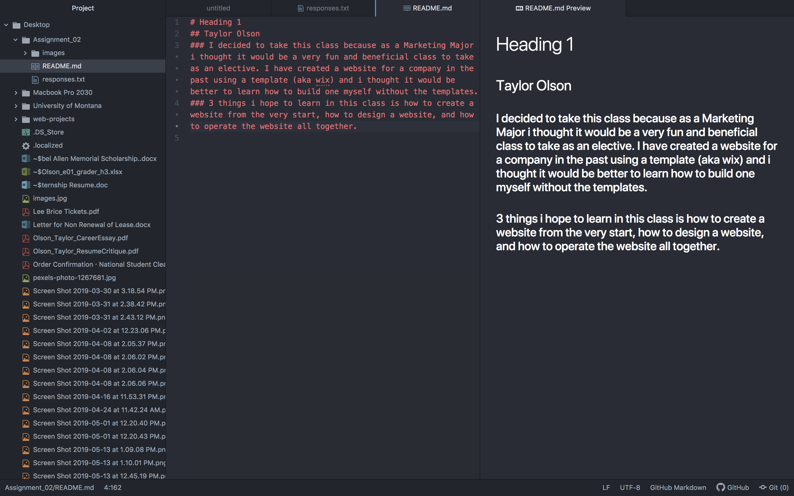

# Heading 1
## Taylor Olson
### I decided to take this class because as a Marketing Major i thought it would be a very fun and beneficial class to take as an elective. I have created a website for a company in the past using a template (aka wix) and i thought it would be better to learn how to build one myself without the templates.
### 3 things i hope to learn in this class is how to create a website from the very start, how to design a website, and how to operate the website all together.  
[Course Website](https://www.buttebrewing.com)

[My Responses](./responses.txt)

